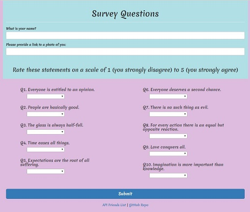

# Friend Finder
An app which matches people with similar interests by taking in user reponses to a short survey and comparing their answers to those of friends internally stored by the app.

This site was developed to practice the use of routes for transferring data between the server and returning responses to the client. 

It makes use of Get and Post http methods for performing reading and creating operations on the server, as well as the following NPM packages:

    * Express - for creating the the server
    * Body-parser - middleware for parsing incoming data making it easier to be interprested/ read 

The site was depoloyed with [Heroku](https://www.heroku.com/home) and is viewable at: https://infinite-earth-99009.herokuapp.com/

